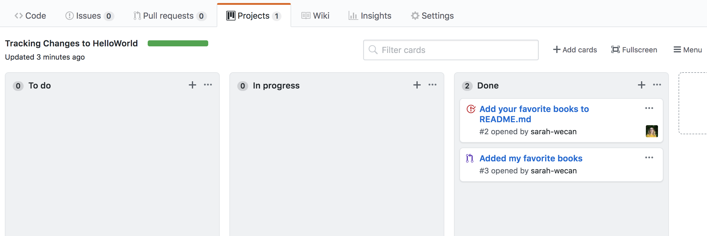

# TestWebAppProject
<<<<<<< HEAD
<<<<<<< HEAD
>>>>>>> 0521-changes0521dfd
=======
=======
<<<<<<< HEAD
<<<<<<< HEAD
=======
=======
>>>>>>> master
>>>>>>> 0517kk

## good stuff

## good stuff here too

<<<<<<< HEAD
- 1
- 2
- 3
- 4
=======
<<<<<<< HEAD
>>>>>>> 0521-changes0521dfd
=======
>>>>>>> 0517kk
- 1. Test Web
- 2. Project
- 3. Deploy
- 4. Repeat
<<<<<<< HEAD
<<<<<<< HEAD
>>>>>>> 0521-changes0521dfd
=======
>>>>>>> master
>>>>>>> 0521-changes0521dfd
=======
>>>>>>> master
>>>>>>> 0517kk

_testing_

#### some test
<<<<<<< HEAD
<<<<<<< HEAD
=======
>>>>>>> master
>>>>>>> 0521-changes0521dfd
=======
>>>>>>> add-github-pane-views
=======
>>>>>>> master
>>>>>>> 0521-changes0521dfd

lalala
=======
>>>>>>> add-github-pane-views
=======
>>>>>>> master
>>>>>>> origin/0521-changes
>>>>>>> 0517kk
